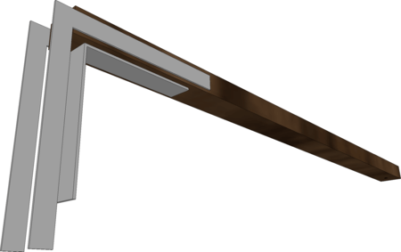

# Aménagement / structure de lit pour Renault Kangoo 2

Il y a quelques années, nous avons aménagé un lit dans notre Kangoo. L'idée initiale était d'en profiter pour partir en week-end en toute autonomie. On voulait donc quelque chose de facile et rapide à construire, pour un usage très occasionnel. Finalement, on a pris goût à la "van-life" et on l'utilise régulièrement pour partir en vacances. La structure n'a presque pas évolué. Pour la réaliser, je me suis appuyé sur plusieurs idées trouvées sur Internet. A mon tour, je partage mes plans.

## Cahier des charges de la structure

- Rentrer entièrement dans le coffre (matelas compris) permettant d'avoir des passagers à l'arrière
- Prendre peu de place quand elle est rangée dans le garage (hors de la voiture)
- Montable/démontable sans outils et rapidement
- Facile et rapide de passer du mode lit au mode conduite (avec 1 conducteur et 1 passager)
- Permettre de ranger beaucoup d'affaires
- Pas chère à construire et ne pas nécessiter d'outils sophistiqués 
- Légère 

## Présentation générale

La structure est composée de plusieurs pièces qui s'assemblent sans outils : le sommier, les bras du sommier, le pied avant et la barre des pieds arrière. Démontée et pliée, elle est ainsi facilement rangeable.

## Le sommier

Il est fait de 4 planches sur lesquelles reposent le matelas et 2 autres planches pour les pieds. Toutes ces planches sont reliées avec des charnières type piano, permettant de la plier.

En mode lit, la planche la plus à l'avant est soutenue par une barre métallique (de penderie à vêtement) attachée aux supports de ceinture à l'aide de cordes. En mode conduite à 2 personnes, seule cette partie doit être rabattue (ainsi que le matelas).

Note : il est facile de couper les charnières piano, je recommande donc d'en acheter des grandes et en faire plusieurs avec une.

## Barre des pieds arrière

Composée d'un tasseau et 4 petites équerres, elle maintient ouvert les pieds arrière du sommier qui s'y emboîtent.

## Bras du sommier

Il y en a 2. Ils reposent d'un côté sur les pieds arrière et de l'autre côté sur le pied avant. Leur but est de soutenir les planches du sommier.

A l'arrière, ils sont percés et traversés par une tige amovible d'environ 8/10cm qui solidarise la planche du sommier, le bras et le pied arrière. J'ai utilisé une longue vis à métal.

A l'avant, la planche du pied vient se coincer entre les équerres, qui la maintienne verticale. Les équerres de devant doivent être suffisamment longues et solides car si l'on freine avec beaucoup d'affaires, celles-ci vont venir taper contre le pied avant et ce sont les équerres qui vont encaisser le choc.

## Pied avant

2 pattes métalliques accueillent les bras du sommier. De l'autre côté, 2 plaques métalliques protègent le bois du frottement des équerres.

Note : à la place des 2 pattes, initialement, j'avais simplement découpé l'empreinte des bras dans la planche du pied mais cela n'a pas tenu - le résineux n'étant probablement pas assez compact.

Si vous avez des questions, n'hésitez pas à me contacter.
